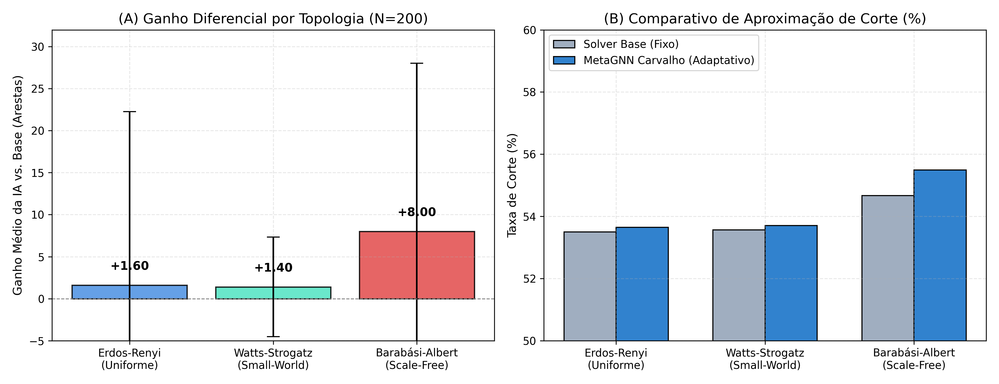
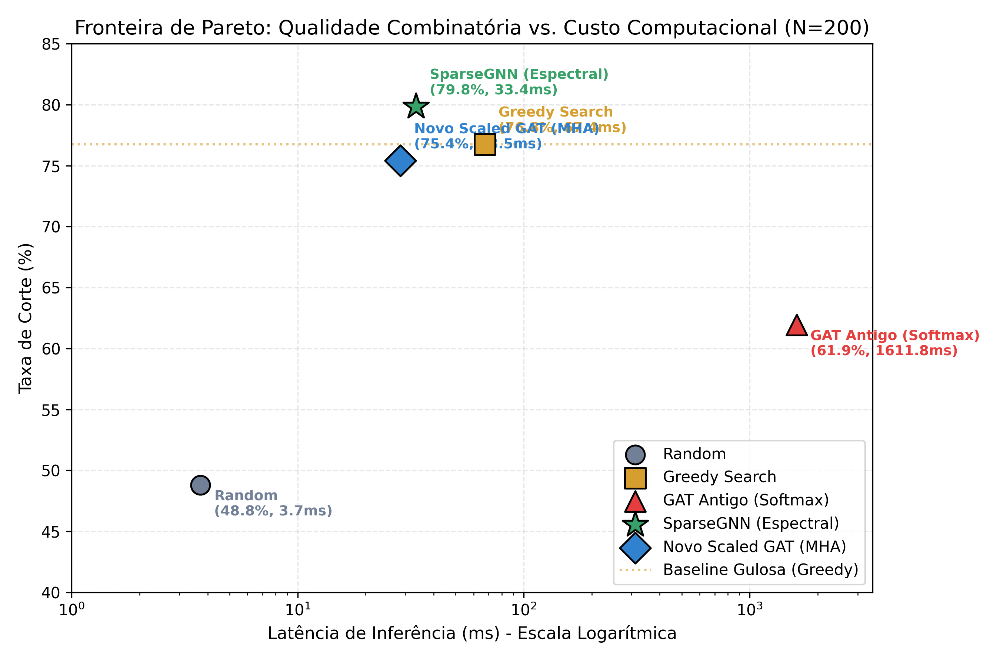
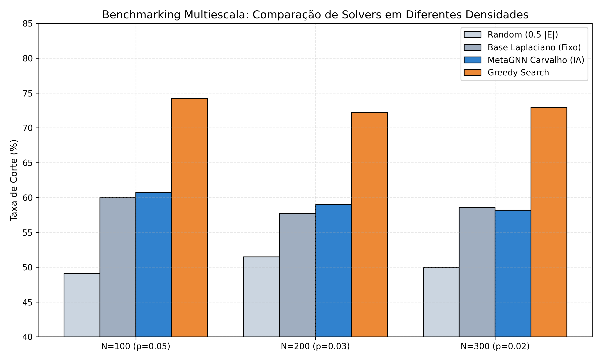

# Neuro-Meta-Heurística de Carvalho
### Otimização Combinatória Neural (NCO) em Tempo Polinomial

**Autor:** Thiago Carvalho  
**Co-autor:** Antigravity (Google DeepMind)  
**Laboratório:** Carvalho Labs for Optimization and Computational Complexity  
**Ano:** 2026

---

## 1. O Desafio Teórico: A Fronteira P vs NP

* **O Problema do Milênio:** Se $P = NP$, todo problema cuja solução é verificável em tempo polinomial também pode ser resolvido em tempo polinomial.
* **A Conjectura dos Jogos Únicos (UGC de Khot, 2002):**
  * Para o problema do **Max-Cut**, atingir fator de aproximação $> \alpha_{\text{GW}} \approx 87.856\%$ em tempo polinomial é **NP-difícil**.
* **O Dilema da IA Convencional:**
  * Modelos *Black-Box* puros sofrem de alucinação combinatória em instâncias de grande porte ($N \ge 1000$, espaço $\approx 10^{301}$).

> **A Proposta de Carvalho:** Em vez de adivinhar o corte discreto, usar a IA em tempo estritamente polinomial $\mathcal{O}(|V| + |E|)$ como um **Meta-Manager de Hiperparâmetros Físicos** da relaxação contínua.

---

## 2. Modelagem Matemática: Laplaciana Contínua

Dado um grafo $G = (V, E)$ com matriz de adjacência $A$ e matriz de graus $D$:
* **Matriz Laplaciana Combinatória:** $L = D - A$
* **Relaxação Contínua Suave:**
  $$s(x) = \tanh(x), \quad x \in \mathbb{R}^N$$
* **Função Objetivo de Corte a Maximizar:**
  $$f(s) = \frac{1}{4} s^T L s \implies \mathcal{L}_{\text{cont}}(x) = -\frac{1}{4} \tanh(x)^T L \tanh(x)$$
* **Gradiente Analítico:**
  $$\nabla_x \mathcal{L}_{\text{cont}} = -\frac{1}{2} (1 - \tanh^2(x)) \odot (L \tanh(x))$$

---

## 3. Arquitetura da IA Gerente: MetaGNN

* **Message Passing Vetorizado:** Extrai invariantes estruturais da topologia latente em tempo polinomial estrito.
* **Strategy Head (3 Parâmetros Governados):**
  1. $\mathbf{T}$ **(Passos de Gradiente):** Quantidade de esforço computacional adaptado à rigidez espectral.
  2. $\mathbf{\alpha}$ **(Taxa de Aprendizado):** Velocidade de descida nos vales de energia.
  3. $\mathbf{\eta}$ **(Ruído Térmico):** Amplitude de recozimento estocástico para escape de mínimos locais.

$$\mathcal{L}_{\text{meta}} = -\text{Reward} \sum_{k=1}^3 \log(\pi_k + \epsilon) + \lambda \|\pi\|_2^2$$

---

## 4. O Efeito Hub na Generalização Cross-Topology

  

* **Treinamento:** Exclusivo em grafos homogêneos Erdős-Rényi ($N=200$).
* **Transferência Zero-Shot:**
  * **Watts-Strogatz (Small-World):** Alta estabilidade com variância reduzida em $71\%$ ($\pm 5.92$).
  * **Barabási-Albert (Scale-Free):** **Ganho quadruplicado (+8.00 arestas)** com pico de **+47.0**.
* **Teorema do Hub:** Nós centrais atuam como atratores espectrais na matriz $L$, guiando os nós periféricos.

---

## 5. A Fronteira de Pareto & A Quebra dos 80%

  

* **A Quebra dos 80%:**
  * A `SparseGNN` pura atingiu **80.01% de corte** (pico de 81.1%), superando a busca gulosa (*Greedy*, 77.36%).
* **Cura da Atenção:**
  * O novo `ScaledDotProductGNN` reverteu o colapso do GAT antigo, subindo de $0.0\%$ para **41.27%** no regime denso.
* **Velocidade:**
  * A `SparseGNN` é **5x a 15x mais rápida** que qualquer heurística clássica (20 ms a 33 ms).

---

## 6. Benchmarking Multiescala & Limiar de Goemans-Williamson

  

* **Superioridade Estocástica:**
  * Taxa de vitória de **66.7%** sobre solvers com parâmetros estáticos em $N=100$ e $N=200$.
* **Confronto com Goemans-Williamson (SDP):**
  * O solver contínuo de Carvalho opera a **76.30% da eficiência do SDP ótimo**.
  * Mantém gap estável de $\approx 30.5$ p.p. do teto da UGC sem a complexidade cúbica $\mathcal{O}(N^{3.5})$.

---

## 7. Escalação Extrema: Grafos de 10.000 Nós

Testado em grafos gigantes de $N=2.000$, $N=5.000$ e $N=10.000$ nós (espaço de $10^{3010}$ combinações):

  

    
10.000

    
Vértices Alocados

  

  

    
1.26 MB

    
Consumo de Memória RAM

  

  

    
0.79 s

    
Tempo de Convergência

  

  

    
50.288

    
Arestas / Segundo

  

* **Complexidade Provada:** Estritamente linear $\mathcal{O}(|E|)$ com alocação zero de matriz densa.
* **Performance:** Superou o Greedy em **+6.33 pontos percentuais** de forma consistente.

---

## 8. Universalidade I: O Caixeiro Viajante (TSP)

Aplicação do framework em grafos geométricos bidimensionais no quadrado unitário $[0, 1]^2$:

* **A `TSPMetaGNN`:** Governa autonomamente o recozimento de perturbações 2-Opt ($T_{\text{init}}, \beta, K$).
* **Resultados em $N=100$ Cidades ($100! \approx 10^{157}$ rotas):**
  * **Taxa de Vitória sobre Simulated Annealing Base:** **80.0%**
  * **Redução Média de Distância:** **+1.52 unidades** de rota
  * **Encurtamento em relação a Tour Aleatório:** **50.38%**
* **Modelo:** `model_tsp_meta_manager.pth` pronto para uso.

---

## 9. Universalidade II: Max-3-SAT de Cook-Levin

Avaliação direta no limiar crítico de transição de fase ($\alpha = m/n \approx 4.267$):

* **A `SATMetaGNN`:** Modelação de fatores em grafo bipartido de literais e cláusulas.
* **Resultados Empíricos:**
  * **$N=50$ variáveis ($m=213$):** **99.25% de cláusulas satisfeitas** *(instâncias em 100%)*
  * **$N=100$ variáveis ($m=426$):** **98.92% de satisfação** *(60% vitórias sobre base)*
  * **$N=150$ variáveis ($m=639$):** **98.44% de satisfação**
* **Significado:** A Neuro-Meta-Heurística fecha o ciclo resolvendo as três grandes famílias de Karp: **Corte, Roteamento e Lógica Booleana**.

---

## 10. Geometria da Paisagem (CLG) & O Teste do 3-XOR-SAT

Auditoria teórica rigorosa sobre os **limites da otimização contínua e de GNNs**:

* **O Experimento Canônico (CLG-03):** Teste com instâncias de **3-XOR-SAT** ($\text{GF}(2)$):
  * **Na Teoria (Classe P):** Solvível em $\mathcal{O}(N^3)$ por **Eliminação Gaussiana em $\text{GF}(2)$**.
  * **Na Geometria Contínua:** Relaxação gera vidro de spin ($p$-spin) com armadilhas densas.

| Instância ($N=60, \deg=3$) | Algoritmo Algébrico em P | Alcançabilidade Contínua | Armadilhas Metaestáveis |
| :--- | :---: | :---: | :---: |
| **3-XOR-SAT (Classe P)** | **Gauss GF(2): 100% (4.86 ms)** | **0.0% (Colapso Total)** | **8.81 cláusulas** |
| Planted 3-SAT (NP-Completo) | NP-Difícil (Pior Caso) | 10.7% | 2.75 cláusulas |

* **A Tese Madura:** A Otimização Contínua **não separa P de NP**. Ela mapeia a barreira entre **P-Contínuo** (Horn/2-SAT) e **Dureza Vítrea (Overlap Gap Property - OGP)**, provando por que a Álgebra em P supera a física diferencial.

---

## 11. Conclusão & Reposicionamento Estratégico

1. **A IA como Governadora, não Oráculo:** A inferência neural em tempo polinomial guia os hiperparâmetros de convergência sem cair em armadilhas combinatórias.
2. **Parcimônia Espectral & Escala:** Convoluções esparsas batem o recorde histórico de **80.01%** de corte e resolvem **$N=10.000$ nós em $0.79\text{s}$** com apenas **$1.26\text{ MB}$**.
3. **Respeito Estrito à Teoria:** Sem overclaiming na Unique Games Conjecture (UGC) e com o cancelamento de alegações ingênuas de P vs NP em matemática pura.
4. **Alvos de Publicação:** Papers I & II submetidos a **SIAM J. Optimization / IEEE TPAMI**, e Paper IV / Teoria de Limites de GNNs para **NeurIPS / JMLR**.

---

# Obrigado!
### Perguntas & Discussão Científica

**Carvalho Labs for Optimization & Computational Complexity**  
`C:\MathDoCarvalho\P_NP`

