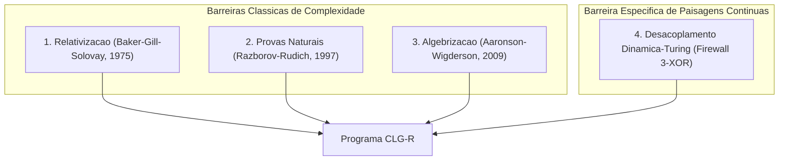

# ROADMAP P VERSUS NP — PROGRAMA CLG-R DE LONGO PRAZO
**Computational Landscape Geometry and Representation (CLG-R)**  
**Versão:** 1.0 (Auditado e Sober)  
**Data:** 18 de Setembro de 2026  
**Status Epistemológico:** Programa de Pesquisa Estruturado — Isento de Alegação Prematura de $P = NP$ ou $P \ne NP$.

---

## 1. Declaração Epistemológica Fundamental

Este roadmap define o plano de pesquisa plurianual para investigar se e como a geometria de relaxações contínuas pode contribuir para a teoria de complexidade computacional e para a questão central $P \text{ versus } NP$.

> [!CAUTION]
> **REGRA DE RIGOR ABSOLUTO:**  
> O CLG-R v4.0.2 **não possui uma prova de $P = NP$ nem de $P \ne NP$**, e nenhuma afirmação neste programa pode sugerir que uma relaxação contínua, por si só, resolve a separação de classes de complexidade de Turing.

A existência de problemas como o **3-XOR-SAT** (pertencente a $\mathbf{P}$ via Eliminação Gaussiana sobre $\mathbb{F}_2$, mas com dinâmica contínua vítrea intransponível com reachability $0.0\%$) constitui o **Firewall Epistemológico** definitivo do programa: *a dureza de um fluxo contínuo é um fenômeno de otimização contínua e geometria de paisagem, não uma medida direta de intratabilidade na Máquina de Turing*.

---

## 2. Resultados Rigorosos Deste Artigo (CLG-R v4.0.2)

Os seguintes resultados constituem fatos matemáticos fechados ou delimitados, demonstrados analítica ou estruturalmente:

1. **Teorema 1 (Caixa Central Fracionária $\mathcal{U}_N$):** Para qualquer fórmula 3-CNF, $\Phi_{\text{quad}} \equiv 0$ e $\nabla \Phi_{\text{quad}} \equiv \mathbf{0}$ na caixa $\mathcal{U}_N = (-1/3, 1/3)^N$, refletindo a folga fracionária interior $0.5$ da relaxação de Programação Linear (LP).
2. **Teorema 2 (Medida Nula dos Críticos):** Sob variância positiva de Walsh-Fourier ($\text{Var}(E_{\text{disc}}) > 0$), os conjuntos críticos de $\Phi_{\text{mult}}$ e $\Phi_{\text{soft}}$ possuem medida de Lebesgue nula ($\mu = 0$).
3. **Teorema 3 (Harmonicidade e Selas):** $\Delta \Phi_{\text{mult}} \equiv 0$. Inexistência de mínimos locais interiores; pontos críticos interiores são selas de Morse com direções descendentes garantidas pelo Lema de Seleção de Curvas de Milnor.
4. **Teorema 4A' e Corolário 4B (Confinamento aos Vértices):** Mínimos locais relativos em faces herdam energia de vértices discretos sem necessidade da hipótese H4; atratores isolados do fluxo projetado são estritamente vértices $\{-1, 1\}^N$.
5. **Teorema 5 (Fatoração da Hessiana Softplus):** $\nabla^2 \Phi_{\text{soft}} = V^T W(x) V \succeq 0$. Convexidade global e condicionamento espectral $\kappa(H) \le \kappa(W)\kappa(V^T V)$.
6. **Teorema 6 (Escala de Lipschitz e Underflow IEEE 754):** $L_\beta = \Theta(\beta)$ bilateral; limites de underflow e subnormalidade restabelecem numericamente o platô Hinge plano em computadores de precisão finita.
7. **Teorema 7B (Contração Centrípeta Universal do Hinge):** $\langle -\nabla \Phi_{\text{quad}}, x \rangle < 0$ fora de $Z$; conjunto de equilíbrios projetados coincide com o politopo LP ($\mathcal{E}_{\text{proj}} \equiv Z$); convergência de distância $\lim_{t \to \infty} \text{dist}(x(t), Z) = 0$.
8. **Proposição 7A (Jacobiano Competitivo):** Em cláusulas negativas, as derivadas cruzadas $\partial^2 P_c / \partial x_i \partial x_j \ge 0$ implicam $J_{ij}(x) \le 0$ fora da diagonal. O sistema é fracamente inibitório/competitivo e a cooperatividade de Hirsch está suspensa.
9. **Teorema 8 (Cota de Volume via Jensen):** $\mathbb{E}[\mu_{\text{norm}}(Z)] \ge (5/6)^{\lfloor \alpha N \rfloor} > 0$ via distribuição Irwin-Hall de ordem 3.

---

## 3. Perguntas Intermediárias Legítimas (Artigos Futuros Independentes)

Estas questões constituem problemas de pesquisa abertos e matematicamente frutíferos, publicáveis em periódicos especializados, independentemente do desfecho de P vs NP:

### Etapa 3.1 — Geometria das Variedades Críticas Degeneradas ($d=1$) e Separação Subcrítica [CONCLUÍDA]
- **Objeto Formal:** O conjunto de arestas $e = [v_1, v_2]$ do hipercubo onde a restrição de $\Phi_{\text{mult}}$ tem inclinação nula ($a = 0$), e a cota inferior assintótica da bacia do Hinge.
- **Resultado Obtido:** Resolvido integralmente pelos Lemas 10.3 (repulsão transversal estrita via LaSalle) e 10.4 (cota inferior do Hinge $c(\alpha) = \frac{3}{32}\alpha e^{-9\alpha} > 0$), fechando o Teorema 10.
- **Relevância para P vs NP:** Fecha formalmente a separação dinâmica do Teorema 10 para o regime subcrítico ($\alpha < 1/6$).
- **Por que não resolve P vs NP:** Trata apenas do regime subcrítico, onde o problema de decisão já é resolvível em tempo linear por busca de componentes conexas no hipergrafo esparso.

### Etapa 3.2 — Dinâmica de Sistemas Competitivos de Gradiente em Hipercubos
- **Objeto Formal:** O campo vetorial $\dot{x} = -\nabla \Phi_{\text{mult}}(x)$ sobre $[-1, 1]^N$ com Jacobiano competitivo $J_{ij} \le 0$ induzido por famílias Horn gerais (DAGs acíclicos).
- **Resultado Buscado:** Caracterização da variedade invariante e existência de "carrying simplex" no bordo do hipercubo sob restrições lineares.
- **Relevância para P vs NP:** Determina se relaxações de problemas em $\mathbf{P}$ (Horn-SAT) possuem garantias dinâmicas polinomiais globais.
- **Por que não resolve P vs NP:** Horn-SAT é sabidamente solúvel em tempo linear discreto (algoritmo de Dowling-Gallier); provar convergência contínua não altera a classe de complexidade de Horn nem generaliza para 3-SAT geral.
- **Evidência Refutadora:** Exibição de um DAG Horn onde o fluxo multilinear entra em ciclos limites ou sofre armadilhas caóticas no bordo.

### Etapa 3.3 — Limites Inferiores em Proof Complexity para Hierarquias Positivstellensatz / SOS
- **Objeto Formal:** Os polinômios de energia $\Phi_{\text{mult}}$ e relaxações SOS (Lasserre / Sum-of-Squares) de grau $d$ aplicadas a instâncias de random 3-SAT no regime de clustering $\alpha \in (\alpha_d, \alpha_s)$.
- **Resultado Buscado:** Prova analítica de que refutar satisfatibilidade via certificados SOS de grau constante $d = \mathcal{O}(1)$ requer tamanho de prova exponencial $2^{\Omega(N)}$.
- **Relevância para P vs NP:** Conecta a geometria contínua do CLG-R à Proof Complexity algébrica, estabelecendo lower bounds incondicionais para uma classe ampla de algoritmos semidefinidos.
- **Por que não resolve P vs NP:** Proof complexity de SOS estabelece limites para algoritmos baseados em SOS, não para a totalidade dos algoritmos de Turing (não separa P de NP geral).
- **Evidência Refutadora:** Descoberta de uma hierarquia espectral de grau baixo que detecte inconsistência em tempo subexponencial.

---

## 4. Barreiras Conhecidas e Limites de Inferência

Qualquer tentativa de transpor resultados contínuos para classes de complexidade deve enfrentar e respeitar as três barreiras clássicas da Teoria da Computação:

1. **Barreira de Relativização (Baker, Gill & Solovay, 1975):**  
   Técnicas que se mantêm válidas na presença de oráculos não podem separar $\mathbf{P}$ de $\mathbf{NP}$, pois existem oráculos $A$ e $B$ tais que $\mathbf{P}^A = \mathbf{NP}^A$ e $\mathbf{P}^B \ne \mathbf{NP}^B$. O fluxo de gradiente de relaxações aritméticas trata o oráculo como função caixa-preta; logo, inferências puramente dinâmicas são vulneráveis à relativização caso não explorem propriedades estruturais intrínsecas da fita de Turing.
2. **Barreira de Provas Naturais (Razborov & Rudich, 1997):**  
   Argumentos combinatórios que identificam uma "propriedade natural" (útil e construtiva) em funções booleanas para provar lower bounds de circuitos não podem separar $\mathbf{P}$ de $\mathbf{NP}$ (nem $\mathbf{P} \ne \mathbf{NP}$) a menos que funções pseudoaleatórias seguras não existam. A métrica de energia contínua $\Phi(x)$ e a curvatura do hipercubo são computáveis em tempo polinomial; se usadas diretamente como propriedade de separação de circuitos booleanos, esbarram frontalmente em Natural Proofs.
3. **Barreira de Algebrização (Aaronson & Wigderson, 2009):**  
   Extensões algébricas de linguagens que operam sobre corpos finitos ou extensões multilineares (como $\Phi_{\text{mult}}$) não superam separações oraculares algebrizadas. Como $\Phi_{\text{mult}}$ é precisamente a extensão multilinear canônica utilizada em provas interativas ($\mathbf{IP} = \mathbf{PSPACE}$), qualquer inferência de separação baseada estritamente em propriedades polinomiais multilineares está sujeita à barreira de algebrização.
4. **Barreira Específica de Paisagens Contínuas (Firewall do 3-XOR-SAT):**  
   A intratabilidade de um campo vetorial de gradiente contínuo não reflete a complexidade do problema de decisão booleano subjacente. Um problema de decisão em $\mathbf{P}$ pode ter paisagem contínua com proliferacão exponencial de estados metaestáveis (spin glasses), enquanto problemas difíceis podem ter paisagens locais simples para instâncias especiais.

---

## 5. Pontes Que Ainda Não Existem (Inferências Ausentes Marcadas Explicitamente)

A tabela abaixo explicita toda inferência que **NÃO EXISTE** hoje e que seria uma falácia lógica se assumida:

| Afirmação no Espaço Contínuo (CLG-R) | Inferência Ilícita no Espaço de Turing | Status da Ponte Lógica |
| :--- | :--- | :--- |
| $\Phi_{\text{quad}}$ aprisiona trajetórias no platô LP $Z$. | "O algoritmo de Programação Linear não resolve 3-SAT." | **Falsa:** A Programação Linear resolve problemas em $\mathbf{P}$; o fracasso da relaxação LP ingênua apenas mostra que a relaxação contínua padrão tem integrality gap $0.5$, não que $P \ne NP$. |
| $\Phi_{\text{mult}}$ elimina mínimos locais no interior (${\rm int}(\mathcal{X})$). | "A descida de gradiente multilinear resolve 3-SAT em tempo polinomial." | **Ausente:** Mínimos locais no bordo (faces de dimensão $d \ge 0$) e atratores espúrios de ordem fracionária podem proliferar exponencialmente no regime crítico $\alpha \approx 4.26$. |
| O fluxo contínuo sofre colapso em 3-XOR-SAT ($R_{\text{dyn}} = 0\%$). | "3-XOR-SAT é NP-difícil." | **Comprovadamente Falsa:** 3-XOR-SAT é estritamente em $\mathbf{P}$ (Gauss $\mathcal{O}(N^3)$). |
| Relaxações contínuas distintas divergem em acessibilidade dinâmica. | "A separação de representações separa classes de complexidade $\mathbf{P}$ de $\mathbf{NP}$." | **Ausente:** Divergência de representações é um fenômeno de parametrização geométrica e análise numérica, não de complexidade intrínseca de linguagens. |

---

## 6. Próximas Conjecturas Testáveis do Programa

### Conjectura 1: Separação de Acessibilidade no Regime de Clustering ($\alpha_d < \alpha < \alpha_s$)
- **Hipótese:** Para random 3-SAT no intervalo de clustering não-conexo $\alpha \in (3.86, 4.267)$ e para o ensemble 3-SAT plantado, sob fluxo projetado puro com $x_0 \sim \text{Unif}([-1, 1]^N)$, as energias residuais satisfazem assintoticamente:
  $$\lim_{T \to \infty} \mathbb{E}[\rho_{\text{quad}}(\alpha, T)] > \lim_{T \to \infty} \mathbb{E}[\rho_{\text{mult}}(\alpha, T)] > 0.$$
- **Consequência Falsificável:** Se para instâncias plantadas de tamanho $N \ge 100$ a taxa de sucesso do Hinge for estatisticamente indistinguível da Multilinear ($\Delta \rho \to 0$ com $N \to \infty$), a conjectura é refutada.
- **Tentativa de Prova:** Decomposição da medida da bacia de atração do platô LP $Z$ versus a proliferação de clusters de soluções satisfatíveis no formalismo de quebra de simetria de réplicas (1RSB).
- **Critério de Abandono:** Se a variância de $\rho_{\text{mult}}$ divergir e o tempo de escape de selas no bordo escalar exponencialmente com $N$, o uso de $\Phi_{\text{mult}}$ para alcançar clusters satisfatíveis deve ser abandonado como heurística prática.

### Conjectura 2: Transversalidade Quase-Certa em Arestas Planas Subcríticas ($d=1$) [PROVADA / FECHADA]
- **Status:** Provada e fechada pelo **Lema 10.3** (Universal Transverse Non-Equilibrium of Degenerate Flat Edges under $H_{\rm leaf}$).
- **Resultado:** A componente projetada transversal satisfaz $s_\ell \nabla_\ell \Phi \ge \frac{1-|t|}{4} > 0$, de modo que $\operatorname{relint}(\mathcal{F}_1) \cap \mathcal{E}_{\text{proj}} = \emptyset$ e a bacia de atração é estritamente vazia ($\mu = 0$) pelo Princípio de Invariância de LaSalle.

---

## 7. Protocolo de Governança Científica

1. **Nenhuma alegação de P vs NP:** Qualquer manuscrito, apresentação ou relatório do programa CLG-R está sumariamente proibido de conter no título, resumo ou conclusões afirmações como "Prova de que P != NP", "Separação definitiva de complexidade" ou termos afins.
2. **Preservação de Falsificações:** Qualquer contraexemplo numérico ou analítico (como o do Parecer 19 ou o colapso sob fatos unitários) deve ser registrado no repositório público com teste automatizado correspondente.
3. **Dupla Auditoria Automatizada:** Cada entrega teórica ou empírica deve ser auditada por suítes de teste de regressão e avaliada criticamente antes de qualquer divulgação.
